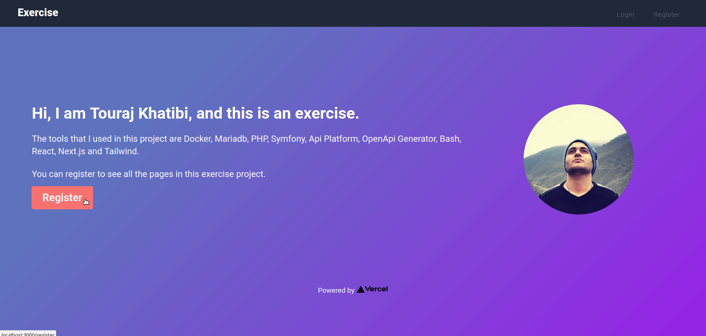
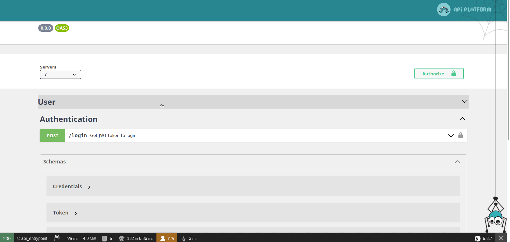

# Exercise

## Prerequisites

Be sure to have installed the list bellow on your machine:

- `git`
- `docker`
- `docker-compose`

If you're on windows you need to use `git-bash` to run commands bellow.

## Setup

```bash
$ git clone git@github.com:tkhatibi/exercise.git
$ cd exercise
$ chmod ugo+x app bin/* scripts/*
$ ./app init
```

After 20 seconds all services will be running.

## Services

### [Web App](http://localhost:3000)


### [Swagger UI](http://localhost:5000/api)


### [Adminer](http://localhost:8880/?server=db&username=exercise&db=exercise)
- system: `MySQL` 
- password: `exercise`

### [PhpMyAdmin](http://localhost:8881)
- username: `exercise`
- password: `exercise`
